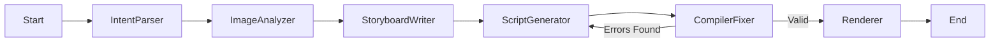

# fotoowl-pipeline

## Project Overview

FotoOwl Pipeline is an AI-powered multi-agent workflow that transforms a folder of event photos into a ready-to-render Remotion video composition.

The project uses LangGraph to coordinate multiple AI agents, Google Gemini for image understanding and language generation, and ChromaDB for Retrieval-Augmented Generation (RAG). Each agent performs a specific task, from analyzing images to generating a Remotion video script.

This project was developed to learn AI agent orchestration and automated video generation workflows.

---

## How it works

The pipeline is made up of six agents that run in sequence. Each one does a single job and passes its output forward through a shared state object.

```

```

**intent_parser** — reads the user's prompt ("cinematic wedding reel, slow and warm") and extracts structured fields: style, tone, pacing, and transition preference.

**image_analyzer** — sends each photo to Gemini Vision and gets back a description, a quality score (0–1), and a few keyword tags. Results are cached locally so re-runs don't burn API quota.

**storyboard_writer** — pulls a relevant style guide from a local Chroma vector store (RAG), then picks the best subset of images and sequences them into a proper storyboard with durations and transitions.

**script_generator** — retrieves Remotion API reference snippets from the same Chroma store, then writes a complete TypeScript/React Remotion composition that implements the storyboard.

**compiler_fixer** — checks the generated script for structural problems (missing imports, unmatched braces, no `<Composition>` tag, etc.). If it finds issues, it sends the error back to `script_generator` for a retry, up to 3 times.

**renderer** — saves the final script to `output/EventReel.tsx`. If `ENABLE_REMOTION_RENDER=1` is set and a Remotion project is present, it also calls `npx remotion render` to produce an MP4.

---

## Project structure

```
├── graph.py               # LangGraph wiring — nodes, edges, conditional retry logic
├── state.py               # PipelineState TypedDict shared across all agents
├── schemas.py             # Pydantic models: VideoIntent, ImageAnalysis, Storyboard
├── model_config.py        # Central model routing (swap models in one place)
├── cache_utils.py         # JSON cache for image analyses
├── agents/
│   ├── intent_parser.py
│   ├── image_analyzer.py
│   ├── storyboard_writer.py
│   ├── script_generator.py
│   ├── compiler_fixer.py
│   └── renderer.py
├── rag/
│   ├── knowledge/         # Style guides + Remotion reference docs (source files)
│   └── chroma_db/         # Built vector store (run build_vectorstore.py once)
├── remotion_project/      # Standalone Remotion TypeScript project
├── input_images/          # Drop your event photos here
├── output/                # Generated .tsx script (and MP4 if rendering is enabled)
└── tests/
    └── test_pipeline.py   # Fully mocked tests — no API key needed
```

---

## Setup

```bash
python -m venv venv
venv\Scripts\activate
pip install -r requirements.txt
```

Create a `.env` file in the project root:

```
GOOGLE_API_KEY=your_key_here
```

---

## Running

**Run the full pipeline** (makes real Gemini API calls):
```bash
venv\Scripts\python.exe graph.py
```

The pipeline reads from `input_images/` and writes the generated Remotion script to `output/EventReel.tsx`. If the compiler validation fails, it automatically retries up to 3 times with the error fed back into the script generator.

**Run tests** (no API key needed, everything is mocked):
```bash
venv\Scripts\python.exe -m pytest tests -v
```

**Test individual agents manually** (makes real API calls):
```bash
venv\Scripts\python.exe test_setup.py
venv\Scripts\python.exe test_intent_parser.py
venv\Scripts\python.exe test_image_analyzer.py
```

**Lint the Remotion project**:
```bash
cmd /c npm run lint
```
> Note: use `cmd /c` on Windows — PowerShell may block `npm.ps1` scripts depending on execution policy.

---

## Enabling video rendering

By default the renderer only saves the `.tsx` script (safe for environments without Node). To attempt actual MP4 rendering:

```bash
$env:ENABLE_REMOTION_RENDER=1
venv\Scripts\python.exe graph.py
```

This requires Node.js and the Remotion project dependencies installed (`cd remotion_project && npm install`).

---

## Model routing

All Gemini calls go through `model_config.py`. Currently everything uses `gemini-2.5-flash-lite` to stay within the free tier's daily limits during development. The routing table documents the intended production model for each agent — switching is a one-line change.

| Agent | Dev model | Production intent |
|---|---|---|
| image_analyzer | flash-lite | flash-lite (high call volume) |
| intent_parser | flash-lite | flash |
| storyboard_writer | flash-lite | flash |
| script_generator | flash-lite | flash |

## Model Selection Rationale

The pipeline uses different Gemini models depending on the workload.

- **intent_parser** – Uses Gemini Flash because prompt understanding is lightweight and prioritizes low latency.
- **image_analyzer** – Uses Gemini Flash Lite since it processes many images and minimizes API cost while maintaining sufficient vision quality.
- **storyboard_writer** – Uses Gemini Flash to balance creativity and speed when generating the storyboard.
- **script_generator** – Uses Gemini Flash because code generation benefits from stronger reasoning while remaining cost-effective.
- **compiler_fixer** – Reuses Gemini Flash to repair generated TypeScript based on compiler feedback.

---
## RAG Design Decisions

The project uses ChromaDB as a local vector store for Retrieval-Augmented Generation (RAG).

### Collections

The vector database stores two categories of documents:

- Remotion documentation
- Video style guides

### Chunking Strategy

Documentation is split into small overlapping chunks before embedding. This improves retrieval accuracy while keeping prompts concise.

### Retrieval Approach

The storyboard writer and script generator perform semantic similarity search against the ChromaDB vector store. The retrieved context is added to the Gemini prompt so that generated storyboards and Remotion scripts are grounded in project-specific knowledge rather than relying only on the language model's internal knowledge.

## Known limitations

- Compiler validation is structural (regex-based), not a real TypeScript compile. A proper integration would shell out to `tsc` or `npx remotion render --dry-run`.
- Full end-to-end rendering needs Node.js + Remotion set up locally.
- No web UI, auth, or job queue — this is a local pipeline, not a production service.
